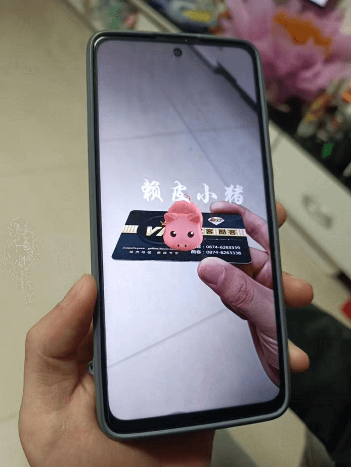
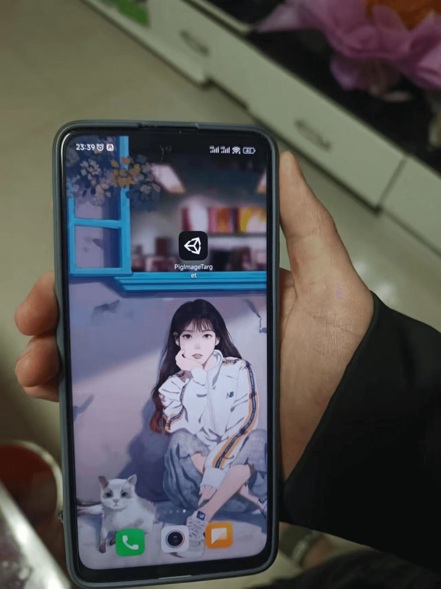
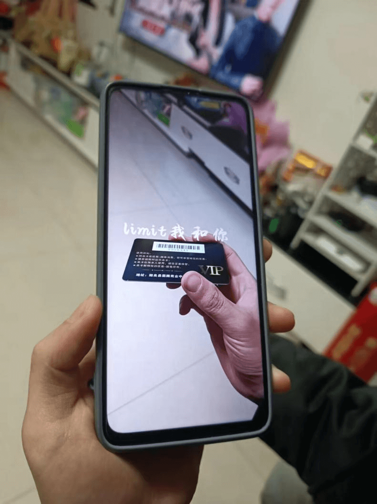

# 🃏 基于AR的卡片扫描全息成像

```markdown
> 作者：Jia'nan Zhao
> 日期：2022 年 12 月  
> 项目类型：综合创新性实践  
> 技术栈：Unity + EasyAR + Android  
```

---

## 📌 项目简介

本项目以增强现实（AR）技术为核心，开发了一个可以在移动设备上运行的小程序，实现通过手机扫描实体卡片的正反面，即可展示 3D 立体成像效果的交互体验。用户在扫描卡片正面时，能够看到一只立体小猪模型及“赖皮小猪”字样；扫描背面时，则浮现“limit我和你”立体文字。



---

## 🎯 实验目标

1. 学习并掌握 EasyAR SDK 的使用；
2. 熟悉 Unity 2020 的开发流程；
3. 独立完成一个 AR 卡片成像项目；
4. 支持模型旋转、缩放等多点交互功能。

---

## 💻 开发环境

- **开发工具**：Unity 2020.3.33f1c2 (64-bit)
- **操作系统**：Windows 10
- **AR引擎**：EasyAR Sense
- **移动设备**：Redmi Note 10 Pro
- **测试平台**：Android

---

## ⚙️ 项目实现流程

### 1. Unity 环境搭建

- 安装 Unity Hub 与 Unity 编辑器；
- 下载并导入 EasyAR SDK；
- 创建 3D 模板并配置与 EasyAR License 匹配的包名；
- 配置 Camera、Tracker 与 ImageTarget；
- 导入识别图片与 3D 模型资源。

### 2. AR 场景设置

- 在 ImageTarget 上挂载识别图片；
- 将模型设置为目标图片激活时显示；
- 通过 AR Session 脚本设置追踪目标；
- 支持用户通过手势控制模型旋转与缩放。

### 3. 交互脚本功能

使用 Unity C# 编写交互脚本：

- 单指滑动控制模型旋转；
- 双指缩放实现模型放大/缩小；
- 限制缩放范围，避免模型失控。

> 💡 [点此查看交互脚本源码](#交互脚本源码)

---

## 🔍 成像演示

| 扫描对象     | 成像效果                                |
|--------------|-----------------------------------------|
| 卡片正面     | 🐷 可爱的立体小猪 + “赖皮小猪” 字样      |
| 卡片背面     | 🧩 “limit我和你” 浮空立体文字             |

### 手机APP



### 扫描正面效果


### 扫描背面效果


---

## 🧠 技术要点解析

- **增强现实（AR）**：通过实时摄像头与传感器，叠加虚拟信息至现实图像；
- **三维注册技术**：实现虚拟模型与真实图像的空间对齐；
- **交互体验设计**：支持实时交互、响应手势、感知角度变化；
- **图像识别触发机制**：识别指定图像后触发对应模型与动画。

---

## 📜 交互脚本源码（C#）

```csharp
using System.Collections;
using System.Collections.Generic;
using UnityEngine;

public class suofang : MonoBehaviour
{
    private Touch oldTouch1;
    private Touch oldTouch2;

    void Update()
    {
        if (Input.touchCount <= 0) return;

        if (Input.touchCount == 1)
        {
            Touch touch = Input.GetTouch(0);
            Vector2 deltaPos = touch.deltaPosition;
            transform.Rotate(Vector3.down * deltaPos.x, Space.World);
            transform.Rotate(Vector3.right * deltaPos.y, Space.World);
        }

        if (Input.touchCount >= 2)
        {
            Touch newTouch1 = Input.GetTouch(0);
            Touch newTouch2 = Input.GetTouch(1);

            if (newTouch2.phase == TouchPhase.Began)
            {
                oldTouch1 = newTouch1;
                oldTouch2 = newTouch2;
                return;
            }

            float oldDistance = Vector2.Distance(oldTouch1.position, oldTouch2.position);
            float newDistance = Vector2.Distance(newTouch1.position, newTouch2.position);
            float offset = newDistance - oldDistance;
            float scaleFactor = offset / 75f;

            Vector3 scale = transform.localScale + Vector3.one * scaleFactor;
            if (scale.x >= 0.5f && scale.x <= 2f)
                transform.localScale = scale;

            oldTouch1 = newTouch1;
            oldTouch2 = newTouch2;
        }
    }
}
````

---

## 📦 项目总结

本项目是 AR 技术结合 Unity 开发的一次有趣实践，旨在将抽象虚拟内容以可视化方式融合进现实世界，创造出更具沉浸感的用户体验。AR 技术的发展也逐渐从实验室走向教育、医疗、工业、广告等广泛应用领域。

---

## 📚 参考技术平台

* [EasyAR 官网](https://www.easyar.com/)
* [Unity 官方网站](https://unity.com/)
* [Redmi Note 10 Pro 参数](https://www.mi.com/)

---

**未来展望**：随着 AR 与 AI 的融合，将诞生出更丰富的交互体验，也会催生更多以“虚实融合”为核心的创意产品。敬请关注我在该领域的更多探索！

---

